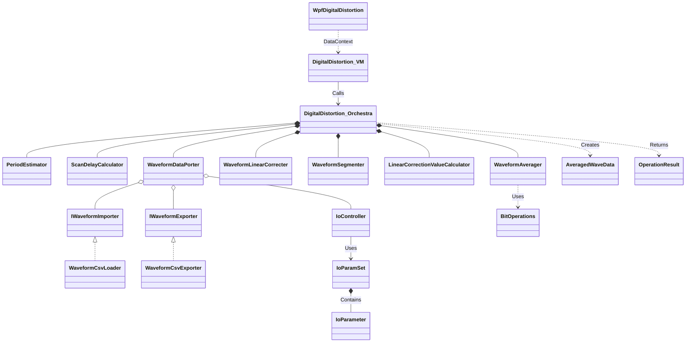

```mermaid
classDiagram
    %% 1. Presentation
    WpfDigitalDistortion ..> DigitalDistortion_VM : DataContext
    DigitalDistortion_VM --> DigitalDistortion_Orchestra : Calls

    %% 2. Orchestration (Composition)
    DigitalDistortion_Orchestra *-- PeriodEstimator
    DigitalDistortion_Orchestra *-- ScanDelayCalculator
    DigitalDistortion_Orchestra *-- WaveformAverager
    DigitalDistortion_Orchestra *-- WaveformLinearCorrecter
    DigitalDistortion_Orchestra *-- WaveformSegmenter
    DigitalDistortion_Orchestra *-- LinearCorrectionValueCalculator
    DigitalDistortion_Orchestra *-- WaveformDataPorter

    %% 3. Data Access & DI
    WaveformDataPorter o-- IWaveformImporter
    WaveformDataPorter o-- IWaveformExporter
    WaveformDataPorter o-- IoController
    
    IWaveformImporter <|.. WaveformCsvLoader
    IWaveformExporter <|.. WaveformCsvExporter

    %% 4. Data Objects & Params
    DigitalDistortion_Orchestra ..> AveragedWaveData : Creates
    DigitalDistortion_Orchestra ..> OperationResult : Returns
    IoController --> IoParamSet : Uses
    IoParamSet *-- IoParameter : Contains

    %% 5. Utilities
    WaveformAverager ..> BitOperations : Uses
```
