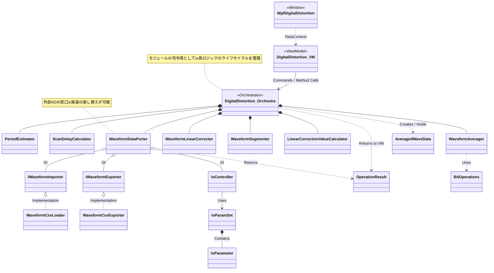

```mermaid
classDiagram
    %% レイヤー定義
    class WpfDigitalDistortion <<Window>>
    class DigitalDistortion_VM <<ViewModel>>
    class DigitalDistortion_Orchestra <<Orchestrator>>
    
    %% 関係性：Presentation
    WpfDigitalDistortion ..> DigitalDistortion_VM : DataContext
    DigitalDistortion_VM --> DigitalDistortion_Orchestra : Commands / Method Calls

    %% 関係性：Orchestraによる強結合 (Composition)
    DigitalDistortion_Orchestra *-- PeriodEstimator
    DigitalDistortion_Orchestra *-- ScanDelayCalculator
    DigitalDistortion_Orchestra *-- WaveformAverager
    DigitalDistortion_Orchestra *-- WaveformLinearCorrecter
    DigitalDistortion_Orchestra *-- WaveformSegmenter
    DigitalDistortion_Orchestra *-- LinearCorrectionValueCalculator
    DigitalDistortion_Orchestra *-- WaveformDataPorter

    %% 関係性：DI (Dependency Injection)
    WaveformDataPorter o-- IWaveformImporter : DI
    WaveformDataPorter o-- IWaveformExporter : DI
    WaveformDataPorter o-- IoController : DI
    
    IWaveformImporter <|.. WaveformCsvLoader : Implementation
    IWaveformExporter <|.. WaveformCsvExporter : Implementation

    %% 関係性：IO & Params
    IoController --> IoParamSet : Uses
    IoParamSet *-- IoParameter : Contains
    WaveformDataPorter ..> OperationResult : Returns

    %% 関係性：Data Flow
    DigitalDistortion_Orchestra ..> AveragedWaveData : Creates / Holds
    DigitalDistortion_Orchestra ..> OperationResult : Returns to VM
    
    %% Utility & Logic
    WaveformAverager ..> BitOperations : Uses
    
    %% Note
    note for DigitalDistortion_Orchestra "モジュールの司令塔として\n各ロジックのライフサイクルを管理"
    note for WaveformDataPorter "外部I/Oの窓口\n実装の差し替えが可能"
```
